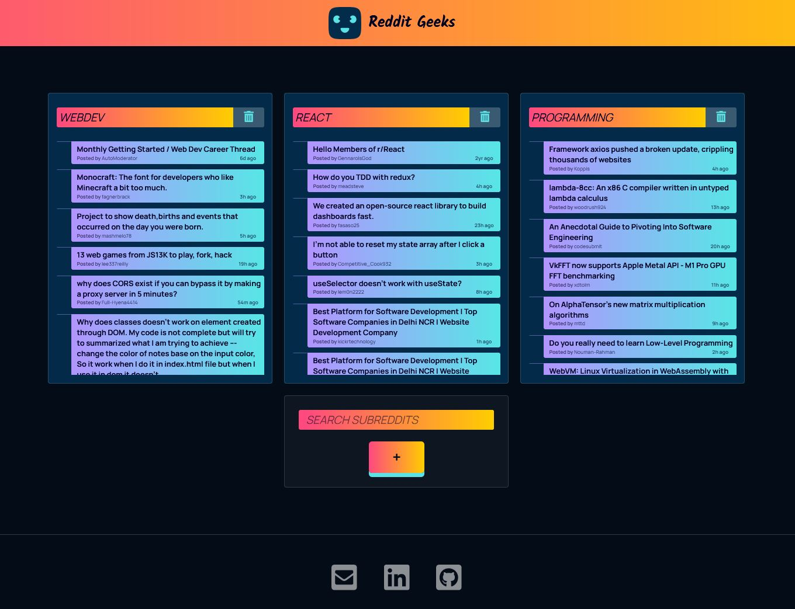

# About

Reddit Geeks is a portfolio project for a subreddit feed app which can search through subreddits and display their articles. 

The projects uses the unofficial JSON Reddit API to recreate a simplified read-only version of the platform.

# Screenshots

# See live 
https://annatas77.github.io/redditgeeks/

# Features

+ Local storage - allows favourite subreddits to be saved in a web browser with no expiration date.

+ Responsive web design approach used to create content that adjusts smoothly to various screen sizes, includes flexible layouts and images and cascading style sheet media queries.

# Technologies

+ JavaScript
+ React
+ CSS
+ localStorage

# Scripts

In the project directory, you can run:

`npm start`

Runs the app in the development mode.

Open http://localhost:3000 to view it in the browser.

The page will reload if you make edits.

# Deployment

GitHub Pages only allows a web source to be either the root or <code>/docs</code> directory, so I've used <code>/docs</code> as a build output to trigger the Github Pages build/hosting feature.